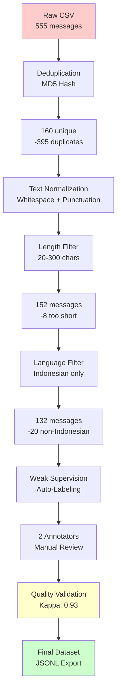

# Indonesian Fintech LLM Data Pipeline

> **Data pipeline for preparing Indonesian fintech customer support messages for Large Language Model (LLM) training**

[](https://www.python.org/downloads/)
[](https://opensource.org/licenses/MIT)
[](docs/guidelines.md#quality-criteria)
[](https://en.wikipedia.org/wiki/Indonesian_language)

---

##  Table of Contents

- [Overview](#overview)
- [Features](#features)
- [Dataset](#dataset)
- [Pipeline Architecture](#pipeline-architecture)
- [Installation](#installation)
- [Usage](#usage)
- [Project Structure](#project-structure)
- [Quality Metrics](#quality-metrics)
- [Documentation](#documentation)
- [Contributing](#contributing)
- [License](#license)

---

##  Overview

This project provides a complete end-to-end pipeline for cleaning, labeling, and validating Indonesian fintech customer support messages. Designed for training LLMs in customer service automation for GoPay-like fintech platforms.

### Problem Statement

Indonesian fintech customer messages contain:
- **Colloquial language** (gaul/slang): "udh", "gw", "banget", "dong"
- **Toxic language**: Profanity and offensive terms
- **High noise**: Duplicates (84.5%), mixed languages, excessive punctuation
- **Emotion intensity**: ALL CAPS, excessive exclamations (!!!!!!)

### Solution

A robust 4-stage pipeline that:
1. **Cleans** raw data (deduplication, normalization, filtering)
2. **Labels** messages (intent, sentiment, urgency, safety)
3. **Validates** quality (Cohen's Kappa, outlier detection)
4. **Exports** production-ready JSONL datasets

---

##  Features

### Data Cleaning
-  **MD5-based deduplication** (84.5% duplicates removed)
-  **Text normalization** (whitespace, punctuation, emoji removal)
-  **Length filtering** (20-300 characters)
-  **Language detection** with Indonesian keyword fallback
-  **Retention rate**: 23.8% (555 → 132 unique messages)

### Multi-Label Classification
-  **Intent**: complaint, inquiry, urgent_request, feedback
-  **Sentiment**: positive, neutral, negative, very_negative
-  **Urgency**: low, medium, high, critical
-  **Safety**: safe, toxic, offensive

### Quality Assurance
-  **Inter-Annotator Agreement**: Cohen's Kappa = 0.93 (Excellent)
-  **Outlier detection**: 6 edge cases identified
-  **Class balance monitoring**: 3 imbalance warnings
-  **Automated validation**: 5 schema checks

### Visualizations
-  6 production-ready charts (distribution, correlation, quality dashboard)
-  Cleaning funnel, Kappa scores, confusion matrix

---

##  Dataset

### Source
- **Type**: Synthetic Indonesian fintech customer messages
- **Domain**: Payment transactions, refunds, account issues, inquiries
- **Platform**: GoPay-like mobile wallet

### Statistics

| Metric | Value |
|--------|-------|
| **Raw messages** | 555 |
| **Unique messages** | 160 (28.8%) |
| **Final dataset** | 132 messages |
| **Retention rate** | 23.8% |
| **Average length** | 39.3 characters |
| **Language** | Indonesian (id) |

### Label Distribution

| Label Type | Most Common | % | Least Common | % |
|------------|-------------|---|--------------|---|
| **Intent** | inquiry | 35.6% | feedback | 12.1% |
| **Sentiment** | neutral | 53.8% | positive | 5.3% |
| **Urgency** | low | 47.7% | critical | 11.4% |
| **Safety** | safe | 68.9% | offensive | 7.6% |

### Sample Data

```json
{
  "id": "msg_117",
  "text": "transaksi gagal tapi duit udh kepotong bangsat",
  "text_length": 46,
  "detected_lang": "id",
  "labels": {
    "intent": "complaint",
    "sentiment": "very_negative",
    "urgency": "medium",
    "safety": "toxic"
  }
}
```

---

##  Pipeline Architecture



### Pipeline Stages

1. **Data Exploration** (`notebooks/data_exploration.ipynb`)
   - Analyze raw data characteristics
   - Detect patterns (toxic words, urgency markers, intents)
   - Generate initial statistics

2. **Data Cleaning** (`notebooks/data_cleaning.ipynb`)
   - Remove duplicates (84.5% reduction)
   - Normalize text (whitespace, punctuation)
   - Filter by length and language
   - Export: `data/processed/cleaned_data.jsonl`

3. **Data Labeling** (`notebooks/data_labeling.ipynb`)
   - Weak supervision with keyword-based auto-labeling
   - Manual review by 2 annotators
   - Export: `data/labeled/labeled_data.jsonl`

4. **Quality Metrics** (`notebooks/quality_metrics.ipynb`)
   - Calculate Cohen's Kappa (0.93 average)
   - Detect outliers (6 edge cases)
   - Generate 6 visualizations
   - Export: `data/labeled/quality_metrics.json`

---

##  Installation

### Prerequisites

- Python 3.12+
- pip (Python package manager)

### Clone Repository

```bash
git clone https://github.com/yourusername/indonesian-fintech-llm-data-pipeline.git
cd indonesian-fintech-llm-data-pipeline
```

### Create Virtual Environment

```bash
# Windows
python -m venv venv
venv\Scripts\activate

# macOS/Linux
python3 -m venv venv
source venv/bin/activate
```

### Install Dependencies

```bash
pip install -r requirements.txt
```

**Core Dependencies:**
- `pandas==2.1.4` - Data manipulation
- `numpy==1.26.2` - Numerical operations
- `jsonlines==4.0.0` - JSONL I/O
- `langdetect==1.0.9` - Language detection
- `scikit-learn==1.3.2` - Cohen's Kappa calculation
- `matplotlib==3.8.2` + `seaborn==0.13.0` - Visualizations

---

##  Usage

### Quick Start (Notebooks)

**Recommended:** Run Jupyter notebooks in order:

```bash
jupyter notebook
```

1. `notebooks/data_exploration.ipynb` - Explore raw data
2. `notebooks/data_cleaning.ipynb` - Clean and filter
3. `notebooks/data_labeling.ipynb` - Label messages
4. `notebooks/quality_metrics.ipynb` - Validate quality

### Command-Line Pipeline (Future)

```bash
# Full pipeline (not yet implemented)
python scripts/run_pipeline.py --input data/raw/synthetic_generated.csv --output data/labeled/

# Individual stages
python scripts/preprocess.py --input data/raw/ --output data/processed/
python scripts/validate.py --input data/labeled/
```

### Configuration

Edit `configs/pipeline_config.yaml`:

```yaml
cleaning:
  min_length: 20        # Minimum characters
  max_length: 300       # Maximum characters
  target_language: id   # Indonesian
  remove_duplicates: true
  normalize_text: true

quality:
  min_kappa: 0.7       # Minimum Cohen's Kappa
  sample_size_iaa: 50  # Sample for IAA calculation
```

Edit `configs/label_schema.json` to customize labels.

---

##  Project Structure

```
indonesian-fintech-llm-data-pipeline/
├── configs/
│   ├── label_schema.json           # Label definitions
│   └── pipeline_config.yaml        # Pipeline parameters
├── data/
│   ├── raw/
│   │   └── synthetic_generated.csv # Original data (555 msgs)
│   ├── processed/
│   │   ├── cleaned_data.jsonl      # Cleaned data (132 msgs)
│   │   ├── validation_report.json  # Validation results
│   │   └── cleaning_log.csv        # Cleaning statistics
│   └── labeled/
│       ├── labeled_data.jsonl      # Final labeled dataset 
│       ├── labeling_stats.json     # Label distribution
│       ├── quality_metrics.json    # Quality metrics 
│       ├── label_distribution.json # Detailed distribution
│       ├── outliers_report.json    # Outlier analysis
│       └── validation_samples.jsonl# Edge cases
├── notebooks/
│   ├── data_exploration.ipynb      # Day 1: EDA
│   ├── data_cleaning.ipynb         # Day 2: Cleaning
│   ├── data_labeling.ipynb         # Day 3: Labeling
│   └── quality_metrics.ipynb       # Day 4: QA
├── outputs/
│   ├── visualizations/             # 12 PNG charts
│   │   ├── 01_*.png                # Exploration
│   │   ├── 02_*.png                # Cleaning
│   │   ├── 03_*.png                # Labeling
│   │   └── 04_*.png                # Quality (6 charts)
│   └── notebook_html/              # HTML exports
├── scripts/                         # (Future) CLI scripts
├── tests/                           # (Future) Unit tests
├── docs/
│   └── guidelines.md               # Labeling guidelines 
├── requirements.txt                 # Python dependencies
└── README.md                        # This file
```

**Key Files:**
-  `data/labeled/labeled_data.jsonl` - **Main output dataset**
-  `data/labeled/quality_metrics.json` - Quality assurance report
-  `docs/guidelines.md` - **Labeling guidelines** (must-read!)

---

##  Quality Metrics

### Inter-Annotator Agreement (Cohen's Kappa)

| Label Type | Kappa | Agreement | Quality |
|------------|-------|-----------|---------|
| Intent | 0.9371 | 95.5% |  Excellent |
| Sentiment | 0.9267 | 95.5% |  Excellent |
| Urgency | 0.9331 | 95.5% |  Excellent |
| Safety | 0.9053 | 95.5% |  Excellent |
| **Average** | **0.9256** | **95.5%** | **Excellent** |

**Interpretation:**
- κ > 0.81 = Excellent (achieved )
- κ > 0.61 = Good
- κ > 0.41 = Moderate

### Class Imbalance Warnings

 **Sentiment**: 10.1x imbalance (neutral 53.8% vs positive 5.3%)  
 **Urgency**: 4.2x imbalance (low 47.7% vs critical 11.4%)  
 **Safety**: 9.1x imbalance (safe 68.9% vs offensive 7.6%)

**Recommendation:** Acceptable for real-world distribution; consider oversampling minority classes during model training.

### Outliers Detected

| Type | Count | Status |
|------|-------|--------|
| Length outliers | 0 |  None |
| Label inconsistencies | 6 |  Documented |
| Statistical anomalies | 0 |  None |

**Documented Edge Cases:**
- 3× Positive sentiment + Complaint intent (e.g., "thanks min udh dibantu")
- 3× Toxic language + Low urgency (profanity ≠ urgency)

See [`docs/guidelines.md#edge-cases`](docs/guidelines.md#edge-cases-troubleshooting) for details.

### Pipeline Efficiency

| Stage | Input | Output | Removed | Rate |
|-------|-------|--------|---------|------|
| Raw data | 555 | 555 | 0 | 0% |
| Deduplication | 555 | 160 | 395 | **71.2%**  |
| Normalization | 160 | 160 | 0 | 0% |
| Length filter | 160 | 152 | 8 | 5.0% |
| Language filter | 152 | 132 | 20 | 13.2% |
| **Total** | **555** | **132** | **423** | **76.2%** |

**Retention Rate:** 23.8% (high data quality → aggressive filtering justified)

---

##  Documentation

### For Data Scientists
-  **[Labeling Guidelines](docs/guidelines.md)** - Comprehensive annotation manual
  - Label definitions with examples
  - Edge case handling (positive+complaint, toxic+low urgency)
  - Quality thresholds and validation rules

### For Engineers
-  **Jupyter Notebooks** - Detailed implementation
  - `data_exploration.ipynb` - EDA with visualizations
  - `data_cleaning.ipynb` - Cleaning pipeline logic
  - `data_labeling.ipynb` - Weak supervision + manual review
  - `quality_metrics.ipynb` - Cohen's Kappa, outliers, correlations

### For Annotators
-  **Quick Reference**:
  ```
  Intent:     complaint | inquiry | urgent_request | feedback
  Sentiment:  positive | neutral | negative | very_negative
  Urgency:    low | medium | high | critical
  Safety:     safe | toxic | offensive
  ```
- See [guidelines.md](docs/guidelines.md) for full definitions

---

##  Methodology

### Weak Supervision Approach

**Auto-Labeling Functions:**
```python
def auto_label_intent(text):
    if any(word in text for word in ['urgent', 'tolong', 'nyangkut']):
        return 'urgent_request'
    elif any(word in text for word in ['gagal', 'error', 'kepotong']):
        return 'complaint'
    elif any(word in text for word in ['berapa', 'gimana', 'bisa']):
        return 'inquiry'
    else:
        return 'feedback'
```

**Human Review:**
- 2 annotators independently review auto-labels
- Resolve disagreements through discussion
- Calculate Cohen's Kappa on 50-sample subset

### Language Detection

**Hybrid Approach:**
1. Check for 2+ Indonesian keywords → classify as `id`
2. Fallback to `langdetect` library
3. Treat Malay (`ms`) and Tagalog (`tl`) as Indonesian

**Indonesian Keywords:**
```python
id_keywords = {
    'min', 'dong', 'banget', 'udh', 'ga', 'gw', 'sih',
    'nih', 'tapi', 'sama', 'nya', 'udah', 'gimana',
    'aja', 'bgt', 'kalo', 'mau', 'pake', 'bisa',
    'tolong', 'urgent', 'refund', 'akun', 'saldo'
}
```

**Why:** `langdetect` fails on ALL CAPS and slang

---

##  Visualizations

Generated in `outputs/visualizations/`:

### Exploration (Day 1)
- `01_length_distribution.png` - Message length histogram
- `01_urgency_markers.png` - CAPS ratio, exclamations, urgency keywords
- `01_intent_distribution.png` - Preliminary intent detection

### Cleaning (Day 2)
- `02_cleaning_funnel.png` - Stage-by-stage data reduction
- `02_length_distribution_cleaned.png` - Final length distribution

### Labeling (Day 3)
- `03_label_distribution.png` - 4-panel label distribution

### Quality (Day 4)
- `04_kappa_scores.png` - Cohen's Kappa by label type 
- `04_label_distribution_pie.png` - Pie charts for all labels
- `04_label_correlation.png` - Heatmap of label correlations
- `04_outliers_scatter.png` - Length outlier detection
- `04_confusion_matrix.png` - Intent label consistency
- `04_quality_dashboard.png` - Comprehensive quality summary 

---

##  Contributing

Contributions are welcome! Please follow these steps:

1. **Fork** the repository
2. **Create** a feature branch: `git checkout -b feature/your-feature`
3. **Make** your changes
4. **Test** thoroughly (run all notebooks)
5. **Commit**: `git commit -m "Add: your feature description"`
6. **Push**: `git push origin feature/your-feature`
7. **Submit** a Pull Request

### Contribution Guidelines

- Follow existing code style (PEP 8)
- Update `docs/guidelines.md` if changing labeling rules
- Add tests for new features (in `tests/`)
- Update `CHANGELOG.md` with your changes

### Areas for Contribution

- [ ] Implement CLI pipeline (`scripts/run_pipeline.py`)
- [ ] Add unit tests (pytest coverage)
- [ ] Support additional label types (e.g., entity extraction)
- [ ] Integrate active learning for annotation efficiency
- [ ] Add multi-annotator support with real Kappa calculation
- [ ] Build web UI for annotation (e.g., Label Studio integration)

---

##  Known Issues

1. **Language detection fails on ALL CAPS**
   - **Workaround:** Indonesian keyword fallback implemented
   - **Status:**  Resolved

2. **Class imbalance in sentiment (10.1x)**
   - **Impact:** May affect model performance on positive class
   - **Mitigation:** Oversample minority class during training

3. **Small dataset size (132 messages)**
   - **Limitation:** May not generalize to all fintech scenarios
   - **Next steps:** Collect more real customer messages

---

##  Authors

- **anggakahfi** - *Initial work* - [@anggakahfi](https://github.com/anggakahfi)

---

##  Acknowledgments

- **Dataset:** Synthetic MOSTLY.ai generated data inspired by GoPay customer support messages
- **Libraries:** pandas, scikit-learn, langdetect, matplotlib, seaborn
- **Methodology:** Weak supervision approach inspired by Snorkel

---

##  Contact

- **Email:** anggastav.k@gmail.com
- **GitHub:** [@anggakahfi](https://github.com/anggakahfi)
- **LinkedIn:** [Angga Kahfi](https://linkedin.com/in/anggakahfi)

---

##  Future Work

### Short-term (v1.1)
- [ ] Implement full CLI pipeline
- [ ] Add pytest unit tests (80% coverage target)
- [ ] Export to Hugging Face Datasets format
- [ ] Add data versioning (DVC)

### Medium-term (v2.0)
- [ ] Collect 1000+ real customer messages
- [ ] Multi-annotator workflow with real Kappa
- [ ] Active learning for efficient annotation
- [ ] Entity extraction (amounts, dates, account numbers)

### Long-term (v3.0)
- [ ] Train baseline LLM (e.g., IndoBERT fine-tuning)
- [ ] Build inference API (FastAPI)
- [ ] Deploy customer support chatbot prototype
- [ ] A/B testing framework for model evaluation

---

##  Changelog

### v1.0.0 (2025-12-19)
-  Initial release
-  4-stage pipeline (exploration, cleaning, labeling, QA)
-  132 labeled messages with 4 label types
-  Cohen's Kappa 0.93 (excellent agreement)
-  12 visualizations
-  Comprehensive documentation (guidelines.md)

---


<div align="center">

**Star this repo if you find it useful!**

[Report Bug](https://github.com/anggakahfi/indonesian-fintech-llm-data-pipeline/issues) · [Request Feature](https://github.com/anggakahfi/indonesian-fintech-llm-data-pipeline/issues) · [Documentation](docs/GUIDELINES.md)


</div>